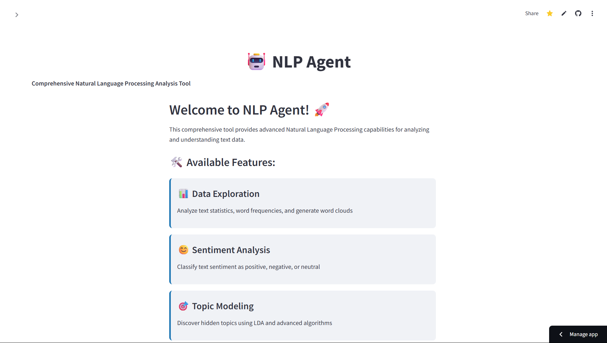
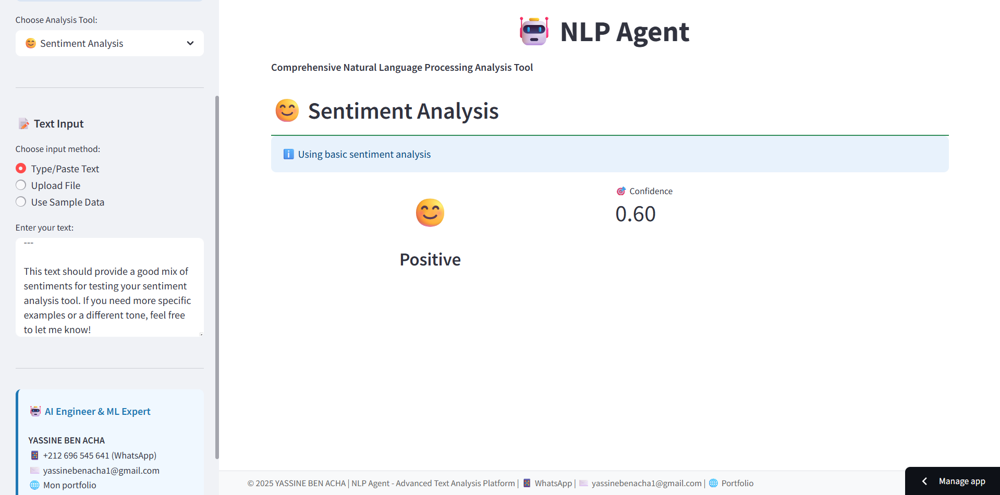
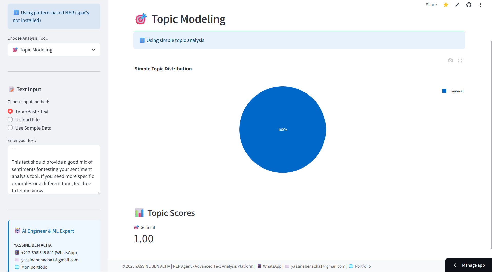

# 🤖 NLP Agent - Interactive Web Application

A comprehensive Natural Language Processing web application built with Streamlit, featuring real-time text analysis with sentiment analysis, topic modeling, named entity recognition, and text summarization.

## 🎯 Project Overview

This project provides an interactive web interface for advanced NLP analysis. Users can upload text or documents and get instant analysis results with visualizations and downloadable reports.

### 🌟 Key Features:
1. **📊 Data Exploration** - Text statistics, word frequencies, and visualizations
2. **😊 Sentiment Analysis** - Multi-approach sentiment classification with confidence scores
3. **🎯 Topic Modeling** - LDA-based topic discovery with interactive charts
4. **🏷️ Named Entity Recognition** - Extract people, organizations, locations, and more
5. **📝 Text Summarization** - Multiple summarization methods with quality metrics

## 📁 Project Structure

```
nlp-agent/
├── app.py                    # 🚀 Main Streamlit application
├── run_app.py               # 🎯 Application launcher script
├── requirements.txt         # 📦 Essential dependencies for deployment
├── README.md               # 📖 This file
├── README_STREAMLIT.md     # 📚 Detailed app documentation
├── data/
│   ├── processed/          # 📊 Processed datasets for the app
│   └── sample/             # 🧪 Sample data for testing
├── notebooks/              # 📓 Jupyter notebooks for development
│   ├── 01_data_exploration_fixed.ipynb
│   ├── 03_topic_modeling_fixed.ipynb
│   ├── 04_named_entity_recognition_fixed.ipynb
│   └── 05_text_summarization_fixed.ipynb
├── src/                    # 🔧 Core NLP modules
│   ├── __init__.py
│   ├── data_preprocessing.py
│   ├── sentiment_analysis.py
│   └── simple_data_preprocessing.py
├── models/                 # 🤖 Trained models
│   ├── lda_model.pkl
│   └── tfidf_vectorizer.pkl
└── visualizations/         # 📈 Generated plots and charts
```

## 🚀 Quick Start

### 🌐 Option 1: Streamlit Cloud (Recommended)
Access the live app instantly:
```
https://nlp-agent.streamlit.app
```

### 💻 Option 2: Local Installation
```bash
# Clone the repository
git clone https://github.com/yourusername/nlp-agent.git
cd nlp-agent

# Install dependencies
pip install -r requirements.txt

# Launch the app
streamlit run app.py
```

### 🎯 Option 3: Quick Launcher
```bash
python run_app.py
```

### 📱 Using the App
1. **Choose Analysis Tool** from the sidebar navigation
2. **Input Text** by typing, uploading file, or using sample data
3. **Analyze** and explore interactive results with visualizations
4. **Download** results as CSV files for further analysis

## 🎯 Features

### 📊 Data Exploration
- **Text Statistics**: Character count, word count, sentence analysis
- **Word Frequency**: Interactive bar charts of most frequent terms
- **Visualizations**: Word clouds and frequency distributions
- **Export**: Download analysis results as CSV

### 😊 Sentiment Analysis
- **Multiple Methods**: TextBlob, rule-based, and advanced algorithms
- **Confidence Scores**: Visual gauge showing prediction confidence
- **Sentence Analysis**: Breakdown of sentiment for individual sentences
- **Real-time**: Instant analysis as you type or upload text

### 🎯 Topic Modeling
- **LDA Integration**: Uses pre-trained topic models
- **Interactive Charts**: Topic probability distributions
- **Word Analysis**: Top words for each discovered topic
- **Fallback Methods**: Simple keyword-based topic detection

### 🏷️ Named Entity Recognition
- **Advanced NER**: spaCy integration for accurate entity extraction
- **Entity Types**: PERSON, ORG, GPE, MONEY, DATE, TIME, EMAIL, PHONE, URL
- **Visual Highlighting**: Color-coded entities in original text
- **Pattern Matching**: Robust fallback using regex patterns

### 📝 Text Summarization
- **Multiple Algorithms**: Frequency-based, TF-IDF, and transformer methods
- **Customizable**: Adjustable summary length and method selection
- **Quality Metrics**: Compression ratio and reduction statistics
- **Comparison View**: Side-by-side original and summary display

## 🛠️ Technologies Used

### 🌐 Web Framework
- **Streamlit**: Interactive web application framework
- **Plotly**: Interactive visualizations and charts
- **Matplotlib**: Static plotting and visualizations

### 🔧 Core Libraries
- **pandas**: Data manipulation and analysis
- **numpy**: Numerical computing
- **scikit-learn**: Machine learning algorithms and TF-IDF

### 🤖 NLP Libraries
- **nltk**: Natural language processing toolkit
- **textblob**: Simple sentiment analysis
- **spacy**: Advanced named entity recognition (optional)

### 📊 Key Features
- **Responsive Design**: Works on desktop and mobile
- **Real-time Processing**: Instant analysis and results
- **Export Functionality**: Download results as CSV
- **Error Handling**: Graceful fallbacks for missing dependencies

## 🎨 Screenshots

### Home Page


### Sentiment Analysis


### Topic Modeling


## 💡 Development

### 📓 Jupyter Notebooks
For development and experimentation, explore the notebooks:
- `01_data_exploration_fixed.ipynb` - Data analysis and visualization
- `03_topic_modeling_fixed.ipynb` - LDA model training
- `04_named_entity_recognition_fixed.ipynb` - NER development
- `05_text_summarization_fixed.ipynb` - Summarization techniques

### 🔧 Local Development
```bash
# Install development dependencies
pip install jupyter notebook

# Start Jupyter
jupyter notebook notebooks/

# Or run the Streamlit app locally
streamlit run app.py
```

## 🚀 Deployment

### Streamlit Cloud
1. Push your code to GitHub
2. Connect to [Streamlit Cloud](https://streamlit.io/cloud)
3. Deploy with one click
4. Your app will be live at `https://your-app.streamlit.app`

### Local Deployment
```bash
# Install dependencies
pip install -r requirements.txt

# Run the app
streamlit run app.py --server.port 8501
```

## 🤝 Contributing

1. Fork the repository
2. Create a feature branch (`git checkout -b feature/amazing-feature`)
3. Commit your changes (`git commit -m 'Add amazing feature'`)
4. Push to the branch (`git push origin feature/amazing-feature`)
5. Open a Pull Request

## 📄 License

This project is licensed under the MIT License - see the LICENSE file for details.

## 👨‍💻 Author

**NLP Agent Developer**
- 🌐 [Live Demo](https://nlp-agentgit-vfa5qveehmppwtg27th6ku.streamlit.app)
- 📧 Contact: [yassinebenacha1@gmail.com]
- 💼 LinkedIn: [https://www.linkedin.com/in/yassine-ben-acha-64332b248]

---

**🎯 Perfect for showcasing NLP skills in internship applications and technical interviews!**
